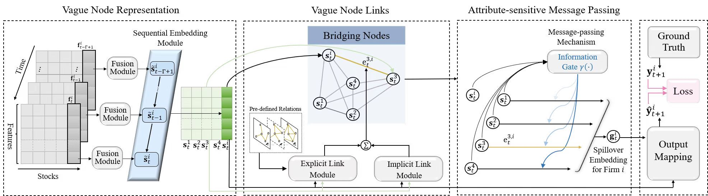

# Learning to Understand the Vague Graph for Stock Prediction with Momentum Spillovers

***
This is the source code of our manuscript, 
named Learning to Understand the Vague Graph forStock Prediction with Momentum Spillovers

## Model architechture
***
 

## Overview
***
* `layers.py` contains three modules of the VGNN model: Vague Node Representation (`TensorFusionLayer`, `MatrixFusionLayer`),
Vague Node Links (`ImplicitLayer`, `ExplicitLayer`), 
  Attribute-sensitive Message Passing (`AttributeGate`);
  
* `models.py` contains the VGNN model;

* `utils.py` contains data loading (`load_data`) 
  and evaluation metrics (`R2_score_calculate`, `IC_ICIR_score_calculate`);

* `train_evaluation.py` puts all of the above together and is uesd to execute
a full training run on our dataset.

* `BackTesting.ipynb` contains the investment simulation experiments.

* `Simulation.ipynb` contains a simple test based on simulated data to vividly illustrate the effectiveness of the proposed tensor-based
fusion for solving dynamic interactions.
## Environment
***
* Python==3.8.5 
  
* PyTorch==1.6.0 
  
* Numpy==1.19.2 
  
* Pandas==1.1.3

## Run
***
```
$ python train_evaluation.py 
```

## Data
***
The dataset can be found at our project website:http://quant.zxlearn.cn
```
Processed data
├── Six Datasets
│   ├── Subset_1.pkl
│   ├── Subset_2.pkl
│   ├── Subset_3.pkl
│   ├── Subset_4.pkl
│   ├── Subset_5.pkl
│   └── Subset_6.pkl
└── Six Datasets relations
    ├── industry
    │   ├── Subset_1_industry_relation.pkl
    │   ├── Subset_2_industry_relation.pkl
    │   ├── Subset_3_industry_relation.pkl
    │   ├── Subset_4_industry_relation.pkl
    │   ├── Subset_5_industry_relation.pkl
    │   └── Subset_6_industry_relation.pkl
    └── location
        ├── Subset_1_location_relation.pkl
        ├── Subset_2_location_relation.pkl
        ├── Subset_3_location_relation.pkl
        ├── Subset_4_location_relation.pkl
        ├── Subset_5_location_relation.pkl
        └── Subset_6_location_relation.pkl
```


